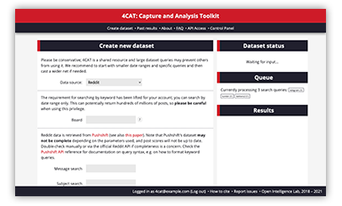
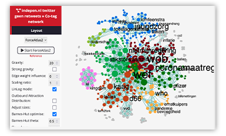

#  4CAT: Capture and Analysis Toolkit

[](https://doi.org/10.5117/CCR2022.2.007.HAGE)
[](https://doi.org/10.5281/zenodo.4742622)
[](https://github.com/digitalmethodsinitiative/4cat/blob/master/LICENSE)
[](https://www.python.org/)
[](https://github.com/digitalmethodsinitiative/4cat/actions/workflows/docker_latest.yml)

<p align="center">4CAT has a website at <a href="https://4cat.nl">4cat.nl</a>.</p>
<p align="center"></p>

4CAT is a research tool that can be used to analyse and process data from
online social platforms. Its goal is to make the capture and analysis of data
from these platforms accessible to people through a web interface, without
requiring any programming or web scraping skills. Our target audience is
researchers, students and journalists interested using Digital Methods in their
work.

In 4CAT, you create a dataset from a given platform according to a given set of
parameters; the result of this (usually a CSV or JSON file containing matching items)
can then be downloaded or analysed further with a suite of analytical
'processors', which range from simple frequency charts to more advanced analyses
such as the generation and visualisation of word embedding models.

4CAT has a (growing) number of supported data sources corresponding to popular
platforms that are part of the tool, but you can also [add additional data
sources](https://github.com/digitalmethodsinitiative/4cat/wiki/How-to-make-a-data-source)
using 4CAT's Python API. The following data sources are currently supported
actively and can be used to collect data with 4CAT directly:

* 4chan and 8kun
* Telegram
* Tumblr

The following platforms are supported through 
[Zeeschuimer](https://github.com/digitalmethodsinitiative/zeeschuimer), with 
which you can collect data to import into 4CAT for analysis:

* Instagram (posts)
* TikTok (posts and comments)
* 9gag
* Imgur
* LinkedIn
* Gab
* Douyin
* X/Twitter

It is also possible to upload data collected with other tools as CSV files. The
following tools are explicitly supported but other data can also be uploaded as
long as it is formatted as CSV:

* Facebook and Instagram (via [CrowdTangle](https://www.crowdtangle.com) or [Facepager](https://github.com/strohne/Facepager) exports)
* YouTube videos and comments (via the [YouTube Data Tools](https://ytdt.digitalmethods.net/))
* Weibo (via [Bazhuayu](https://www.bazhuayu.com/))

A number of other platforms have built-in support that is untested, or requires
e.g. special API access. You can view the [data sources in our wiki](https://github.com/digitalmethodsinitiative/4cat/wiki/Available-data-sources) or review [the data
sources' code](https://github.com/digitalmethodsinitiative/4cat/tree/master/datasources)
in the GitHub repository.

## Installation
You can install 4CAT locally or on a server via Docker or manually. For easiest installation, we recommend copying our [`docker-compose.yml file`](https://raw.githubusercontent.com/digitalmethodsinitiative/4cat/master/docker-compose.yml), [`.env`](https://raw.githubusercontent.com/digitalmethodsinitiative/4cat/master/.env) file, and running this terminal command in the folder where those files have been saved:

```
docker-compose up -d
```

In depth instructions on both Docker installation and manual installation can be found [in our
wiki](https://github.com/digitalmethodsinitiative/4cat/wiki/Installing-4CAT). A video walkthrough installing 4CAT via Docker can be found on [YouTube here](https://youtu.be/oWsB7bvNfOY).

Currently scraping of 4chan, 8chan, and 8kun require additional steps; please see the wiki.

Please check our
[issues](https://github.com/digitalmethodsinitiative/4cat/issues) and create
one if you experience any problems (pull requests are also very welcome).

### Upgrading 4CAT
Instructions on upgrading 4CAT from previous versions [can be found in our wiki](https://github.com/digitalmethodsinitiative/4cat/wiki/Upgrading-4CAT).

## Modules
4CAT is a modular tool and easy to extend. The following two folders in the 
repository are of interest for this: 

- `datasources`: Data source definitions. This is a set of configuration
  options, database definitions and python scripts to process this data with.
  If you want to set up your own data sources, refer to the
  [wiki](https://github.com/digitalmethodsinitiative/4cat/wiki/How-to-make-a-data-source).
- `processors`: A collection of data processing scripts that can plug into
  4CAT to manipulate or process datasets created with 4CAT. There is an API
  you can use to [make your own
  processors](https://github.com/digitalmethodsinitiative/4cat/wiki/How-to-make-a-processor).

## Credits & License
4CAT was created at [OILab](https://oilab.eu) and the
[Digital Methods Initiative](https://www.digitalmethods.net) at the University
of Amsterdam. The tool was inspired by
[DMI-TCAT](https://wiki.digitalmethods.net/Dmi/ToolDmiTcat), a tool with
comparable  functionality that can be used to scrape and analyse Twitter data.

4CAT development is supported by the Dutch [PDI-SSH](https://pdi-ssh.nl/en/)
foundation through the [CAT4SMR project](https://cat4smr.humanities.uva.nl/).

4CAT is licensed under the Mozilla Public License, 2.0. Refer to the `LICENSE`
file for more information.
