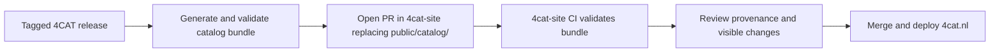

# Module Catalogue: Static Export Contract

## Purpose

4CAT renders its module catalogue — every data source and processor in a
release, with compatibility information and provenance — using one shared
renderer in two places:

- inside the running 4CAT application, backed by its live API; and
- as a self-contained static bundle published on the public 4CAT website
  ([`4cat-site`](https://github.com/digitalmethodsinitiative/4cat-site)) at
  `https://4cat.nl/catalog/`.

This document is the standing contract for the **static export**: what the
exporter must produce so that `4cat-site` can publish the catalogue with no live
4CAT instance, no catalogue API, and no server-side templating.

4CAT owns the exported content and the renderer. `4cat-site` integrates and
deploys the bundle; see its `docs/catalogue-site-integration.md` for the
consuming side of this contract.

## Ownership boundary

| Concern | Owner |
| --- | --- |
| Module metadata, compatibility mapping, renderer, generated CSS/JS/data | 4CAT export (this repository) |
| The exported `catalog/` bundle | 4CAT export, reviewed in `4cat-site` |
| `/catalog/` public route, homepage link, deployment, caching | `4cat-site` |
| Extensions library | `4cat-site`; excluded from this export |

## Where this lives in 4CAT

| File | Role |
| --- | --- |
| [`helper-scripts/export_module_catalogue.py`](../helper-scripts/export_module_catalogue.py) | The exporter. Builds the bundle, writes the manifest, and runs the validation below. |
| [`webtool/static/module-catalog/index.html`](../webtool/static/module-catalog/index.html) | The static page shell, and the only place `window.MODULE_CATALOG_SOURCE` is defined. Declares which `format_version` and `schema_version` it can read. |
| [`webtool/templates/components/module-catalog-body.html`](../webtool/templates/components/module-catalog-body.html) | The catalogue markup, shared verbatim by the static page and the live one. Must stay plain HTML. |
| [`webtool/templates/module-catalog.html`](../webtool/templates/module-catalog.html) | The live 4CAT page. Includes the shared markup and supplies what only Flask can. |
| [`webtool/static/js/module-catalog.js`](../webtool/static/js/module-catalog.js) | The shared renderer, copied into the bundle unchanged as `assets/catalogue.js`. Falls back to the live API adapter when no `MODULE_CATALOG_SOURCE` is defined. |
| [`webtool/static/css/module-catalog.css`](../webtool/static/css/module-catalog.css) | Catalogue styling. Published together with `fourcat-new.css` and everything it imports, so the public page tracks the application's design. |
| [`common/lib/processor_map.py`](../common/lib/processor_map.py) | Computes the catalogue and detail records. The exporter serialises exactly what the live API returns. |
| [`webtool/views/api_processor_map.py`](../webtool/views/api_processor_map.py) | The live API the same renderer uses inside the application. |
| [`tests/test_module_catalogue_export.py`](../tests/test_module_catalogue_export.py) | Enforces this contract, including that each refusal below actually happens. |

Two properties keep the public catalogue and the one inside 4CAT from drifting
apart, and the exporter refuses to publish if either lapses:

- Both pages read their markup from one shared file, so neither can quietly grow
  its own copy.
- The published stylesheets are discovered by following `fourcat-new.css`'s own
  imports rather than from a list kept here, so adding or removing part of 4CAT's
  styling needs no change to the exporter.

## Running the export

```bash
python helper-scripts/export_module_catalogue.py --output dist/catalogue
```

4CAT's dependencies must be importable, so in a Docker install run it inside the
backend container. Serve the result with any static file server to review it —
opening `index.html` from disk will not work, because browsers block `fetch()` on
`file://` URLs.

For a release, name the tag explicitly:

```bash
python helper-scripts/export_module_catalogue.py --output dist/catalogue --release-tag v1.56
```

Without `--release-tag`, a release is claimed only when the commit carries a tag
exactly. **A CI checkout is usually shallow and has no tags**, so a genuine release
left to work it out from git would publish itself as a development snapshot. Release
automation should always pass the tag.

## Bundle shape

The exporter produces one self-contained directory that is copied verbatim into
`4cat-site` at `public/catalog/`:

```text
catalog/
    index.html             # static page; defines the static data adapter
    manifest.json          # bundle entry point (read first)
    data/
        catalogue-v1.json  # module summaries + details
    assets/
        catalogue.js       # shared renderer (the same file the live app uses)
        css/
        fontawesome/
        img/
```

Every reference inside the bundle resolves to another file inside the bundle. The
bundle must work from a plain static web server with no application behind it, and
must not depend on being served from any particular path.

## `manifest.json` — the bundle entry point

`manifest.json` is the single file the public page reads first. It names the data
file to load and describes the source revision the catalogue was built from.

Current contract: **`format_version` 2.**

Release build:

```json
{
  "format_version": 2,
  "data_schema_version": 1,
  "source": {
    "kind": "release",
    "fourcat_version": "1.56",
    "release_tag": "v1.56",
    "git_describe": "v1.56",
    "git_commit": "a6e11f52ea3ca3a4a030e54f86ec555f33dd9099",
    "generated_at": "2026-07-28T10:42:50+02:00"
  },
  "data_file": "data/catalogue-v1.json"
}
```

Development snapshot (any commit that is not exactly on a release tag):

```json
{
  "format_version": 2,
  "data_schema_version": 1,
  "source": {
    "kind": "development_snapshot",
    "fourcat_version": "1.56",
    "release_tag": null,
    "git_describe": "v1.55-146-g8f0c31da1",
    "git_commit": "8f0c31da1c9b520c8a8705e5975fca253fe95eb2",
    "generated_at": "2026-07-28T16:31:01+02:00"
  },
  "data_file": "data/catalogue-v1.json"
}
```

| Field | Meaning |
| --- | --- |
| `format_version` | Version of the static bundle/manifest contract. Increment for breaking manifest changes. Currently `2`. |
| `data_schema_version` | Expected `schema_version` in the data JSON. Currently `1`. |
| `source.kind` | `release` or `development_snapshot`. |
| `source.fourcat_version` | 4CAT version reported by the build. |
| `source.release_tag` | Exact Git release tag, or `null` when the commit is not exactly tagged. |
| `source.git_describe` | Human-readable `git describe` output; may describe a commit after a tag. |
| `source.git_commit` | Full immutable source revision. |
| `source.generated_at` | ISO 8601 timestamp with timezone. |
| `data_file` | Relative path from `catalog/` to the data JSON. |

## Data file

The data JSON keeps its own `schema_version` (currently `1`), which describes the
module-data format. `format_version` describes the outer bundle; the two solve
different compatibility problems and must not be conflated.

The data file contains:

- `catalogue`: an array of module **summaries** used to draw the browse grid.
- `modules`: an object of module **detail** records keyed by module `type`.

Invariants:

- Every module `type` is unique and non-empty.
- Every `catalogue` summary has exactly one matching `modules` detail record, and
  there are no detail records without a summary.

## Provenance rules

Determine at export time whether the source commit is exactly tagged.

- Exact release tag → `source.kind = "release"`, `release_tag` = that tag.
- Any commit after a tag → `source.kind = "development_snapshot"`,
  `release_tag = null`.
- Always include the full commit hash and `git describe` output.
- **Never infer a release tag from `git describe` alone.** A value like
  `v1.55-146-g8f0c31da1` means 146 commits after `v1.55`; it is not a release.

The published page uses these fields to say either "Catalogue for 4CAT v1.56" or
"Development snapshot of 4CAT 1.56 — not a released version". Truthful provenance
here is what keeps the public page honest.

## Fully static bundle

- No Flask/Jinja template syntax and no calls to a live 4CAT API in the exported
  files. The export must refuse to publish if it finds unresolved template
  delimiters or other server-side placeholders.
- Every path to HTML, JavaScript, CSS, images, Font Awesome assets, and data is
  relative to the file that names it, never rooted at `/`, and always resolves to
  something inside the bundle. That is what lets `catalog/` be served from any
  location without rewriting it.
- The static page defines `window.MODULE_CATALOG_SOURCE` as the data adapter for
  the shared renderer: it reads the exported JSON and addresses modules with
  `?module=<type>`. The live 4CAT application keeps its own API adapter; the
  renderer is otherwise identical in both.
- Extensions are excluded until the extension-library policy and data model are
  defined separately.
- The page currently loads its typefaces from Google Fonts (one external
  request). This is an accepted design choice; a future exporter may bundle the
  font files locally if privacy, offline use, or typography consistency justifies
  it.

## Export validation

The exporter must fail rather than publish a partially valid bundle. Before
finalising the bundle, confirm:

1. `manifest.json` and the file named by `data_file` parse as JSON.
2. `format_version` and the data `schema_version` are the versions the generated
   renderer supports.
3. Every `catalogue` summary has exactly one matching `modules` detail record,
   with no extra detail records.
4. Every module has a unique, non-empty `type`.
5. `data_file` exists below the exported `catalog/` directory.
6. Every local file referenced by the generated HTML and CSS exists.
7. The exported HTML contains no unresolved template delimiters or other
   server-side placeholders.
8. The generated renderer is present and not empty, and passes a JavaScript syntax
   check where one can be run.

Check 2 is a cross-check between the page and the exporter: the page states the
versions it can read, and the exporter compares its own output against that
statement. Neither side can move without the other noticing.

Check 8 is conditional. The syntax check runs `node --check`, and **node is not part
of the 4CAT Docker image**, so in a normal export it is reported as not run rather
than silently assumed. Release automation should run the same check as a separate
step on a runner that has node. The renderer is copied byte-for-byte from
`webtool/static/js/module-catalog.js`, so a failure here means 4CAT's own file is
broken.

Report the source kind, release tag (when present), commit, module count, output
directory, and whether the renderer was syntax-checked in the build log.

`4cat-site` re-runs the equivalent static checks on every pull request that
touches the bundle (`scripts/validate_catalog.py` there), but the exporter is the
first line of defence and should not emit a bundle those checks would reject.

## Release and handoff flow



- Use **tagged releases** as the source for the public production catalogue.
- Replace the **complete** `public/catalog/` directory in one pull request; do
  not copy individual data or asset files into an existing export. This keeps the
  page, renderer, styles, and data in a known-compatible set. In practice, build
  the directory fresh so files a newer export no longer produces are removed
  rather than left behind.
- Do not auto-merge initially. Review is a useful final check on release
  provenance, module count, visible descriptions, and unintended changes.
- Development snapshots may be exported for local testing or a staging site, but
  should not silently replace the public release catalogue.

## Changing the contract

`format_version` and `data_schema_version` are the coordination points between
this repository and `4cat-site`:

- Bump `data_schema_version` when the module-data shape changes incompatibly.
- Bump `format_version` when the manifest/bundle contract changes incompatibly.
- Ship a renderer that understands the new version, and coordinate the change
  with `4cat-site` — whose loader checks both versions and will reject a bundle it
  does not recognise — before publishing.

See `4cat-site`'s `docs/catalogue-site-integration.md` for the consuming side.
